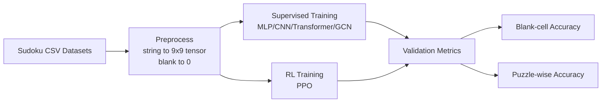
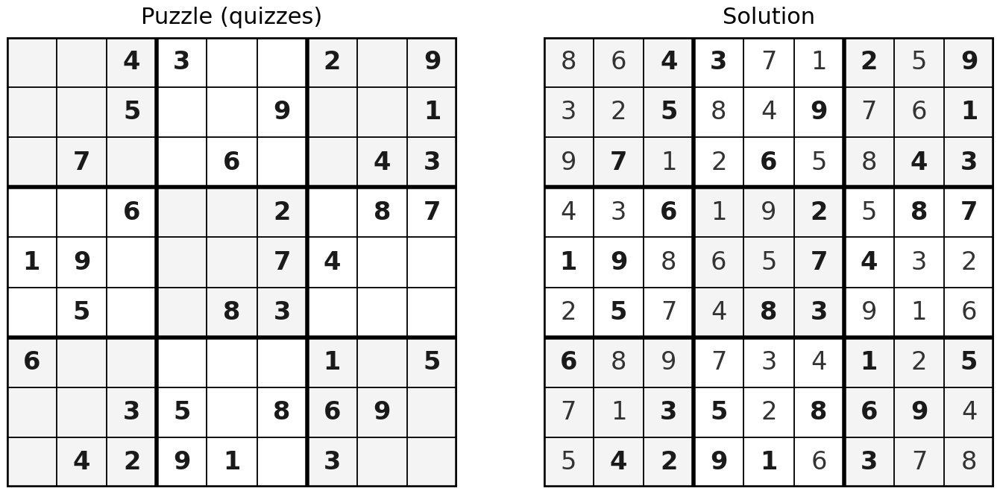
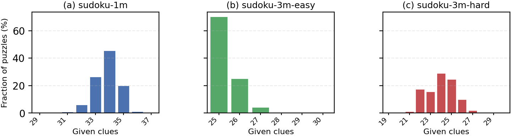
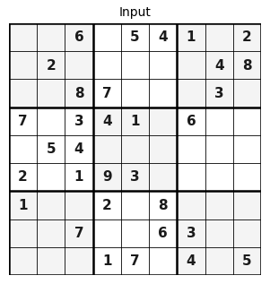
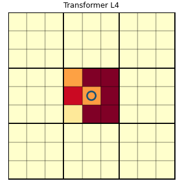
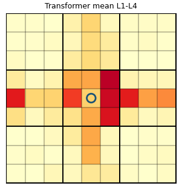
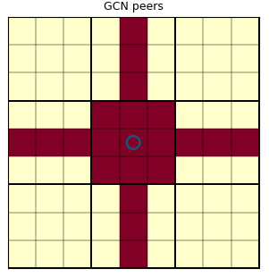
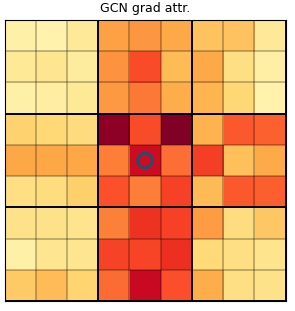
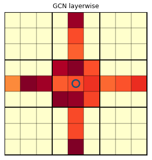
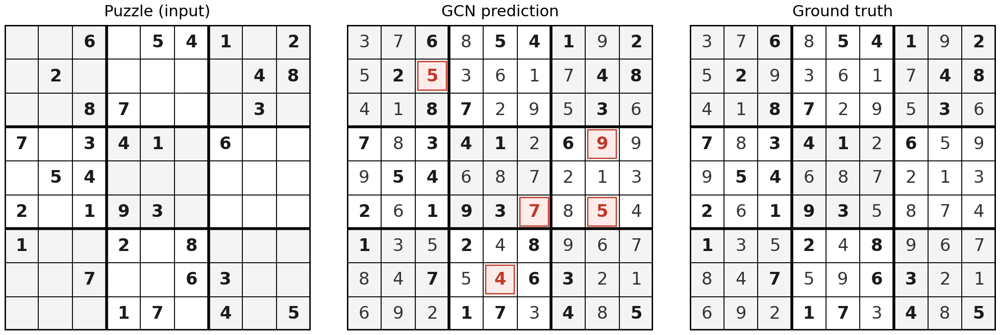

# COMP5214 Course Project: Neural Architectures for Sudoku Reasoning

> HKUST `COMP5214 Advanced AI Architectures` course project  
> Topic: comparing how different neural architectures reason over Sudoku constraints

## 1. Project Overview

This project studies one central question: **How do different neural architectures reason about Sudoku constraints?**

Classical methods (e.g., CSP/DLX) can almost perfectly solve standard `9x9` Sudoku. The motivation for neural methods is different: once trained, a model can perform fast fixed-depth forward inference, which is attractive for large-scale deployment and learned reasoning settings.

Under a unified setup, this project compares:

- Supervised learning: `MLP`, `CNN`, `Transformer`, `GCN`
- Reinforcement learning: `PPO` (with/without structural guidance)

The main implementation is in `sudoku_proj.ipynb`, and the full report is in `report/`.

## 2. Research Questions

- Which architecture is better at propagating row/column/subgrid constraints?
- Does high blank-cell accuracy necessarily translate to full-board solving ability (puzzle-wise accuracy)?
- Is PPO performance driven by policy learning itself or by structural guidance (MRV + candidate mask)?

## 3. Pipeline (Figure)





## 4. Datasets

Public Kaggle datasets are used (all `9x9` Sudoku):

- `sudoku-1m`: 1 million puzzles (experiments in the report typically use `N=20,000` subsamples)
- `sudoku-3m`: 3 million puzzles
- Rule-based subsets derived from `sudoku-3m`:
  - `sudoku-3m-easy` (lower difficulty and more clues)
  - `sudoku-3m-hard` (higher difficulty or fewer clues)

Default train/validation split: `80% / 20%` (on the 20k subsample).

### Dataset Visualizations



## 5. Models and Design Choices

- **MLP**: no explicit spatial or relational inductive bias
- **CNN**: local convolutional receptive fields for nearby patterns
- **Transformer**: global self-attention for long-range dependencies
- **GCN**: message passing on the Sudoku peer graph (same row/column/subgrid), closely matching task structure
- **PPO**: sequential decision process (“choose cell + choose digit”), optionally with MRV and candidate masking

## 6. Experimental Setup

- Supervised optimizer: `AdamW`
- Learning rate: `1e-3`
- Weight decay: `1e-2`
- Batch size: `64`
- Epochs: `50`
- Main metrics:
  - **Blank-cell accuracy**: correctness only on originally empty cells
  - **Puzzle-wise accuracy**: percentage of puzzles with all 81 cells correct (stricter)

## 7. Key Results (Data)

### 7.1 Supervised Models (all-cell loss, 50 epochs, N=20k)

| Model | sudoku-1m (Blank / Puzzle) | 3m-easy (Blank / Puzzle) | 3m-hard (Blank / Puzzle) |
| --- | ---: | ---: | ---: |
| MLP | 55.8% / 0.0% | 32.5% / 0.0% | 30.7% / 0.0% |
| CNN | 30.6% / 0.0% | 22.1% / 0.0% | 21.5% / 0.0% |
| Transformer | 95.6% / 30.1% | 52.8% / 0.0% | 52.9% / 0.0% |
| GCN | **97.2% / 40.6%** | **58.1% / 0.0%** | **53.6% / 0.0%** |

**Observations:**
- `GCN` achieves the best blank-cell accuracy across all three datasets.
- `Transformer` is very strong on `sudoku-1m` but drops notably on `3m` distributions.
- High blank-cell accuracy does not guarantee high puzzle-wise accuracy; on harder distributions, puzzle-wise scores collapse for almost all models.

### Qualitative Analysis: Attention / Influence Maps

Input puzzle used for qualitative analysis:



Transformer attention (last layer):



Transformer attention (mean over layers):



GCN structural peer influence:



GCN gradient-based attribution:



GCN layer-wise accumulated influence:



### 7.2 PPO 2x2 Ablation (sudoku-1m)

| PPO Mode | Blank-cell | Puzzle-wise |
| --- | ---: | ---: |
| guided (MRV + mask) | **99.97%** | **99.95%** |
| mrv_only | 18.6% | 0.0% |
| mask_only | 16.1% | 0.0% |
| free | 13.9% | 0.0% |

**Conclusion:** PPO’s near-perfect score is highly dependent on structural guidance (MRV + candidate mask). Removing either component causes performance to fall close to random-level behavior.

### Failure Case Visualization

Even with strong blank-cell accuracy, full-board correctness can fail:



## 8. Main Takeaways

- For strongly constrained tasks like Sudoku, **relational inductive bias** is critical: `GCN > Transformer >> MLP/CNN` (under this compute budget).
- Evaluation must include both blank-cell and puzzle-wise metrics; using only blank-cell accuracy can overestimate true solving ability.
- RL is not automatically superior here; performance is tightly coupled with constraint engineering.

## 9. Repository Structure

```text
.
├── sudoku_proj.ipynb         # Main experiment notebook (models, training, evaluation, visualization)
├── data/                     # Raw and processed Sudoku CSV files
│   ├── sudoku.csv
│   ├── sudoku-3m.csv
│   ├── sudoku-3m-easy.csv
│   └── sudoku-3m-hard.csv
├── scripts/                  # Plotting, splitting, and helper scripts
│   ├── split_sudoku_3m_by_difficulty.py
│   ├── plot_clues_distributions.py
│   ├── plot_attention_heatmaps.py
│   └── ...
└── report/                   # Course report (LaTeX)
```

## 10. Quick Start

1. Install dependencies (example):

```bash
pip install torch pandas numpy matplotlib tqdm jupyter
```

2. Open and run the notebook:

```bash
jupyter notebook sudoku_proj.ipynb
```

3. To reproduce figures, run the corresponding scripts in `scripts/` (e.g., clue distribution, attention heatmaps, failure case plots).

## 11. Limitations and Future Work

- Most experiments use `N=20k` subsamples instead of systematic full-scale training.
- More multi-seed runs and confidence intervals are needed for stronger statistical robustness.
- Future directions include stronger constraint-consistency correction, hybrid neuro-symbolic decoding, and matched-protocol replication against diffusion+RL approaches.

## 12. Course Info

- Course: HKUST `COMP5214 Advanced AI Architectures`
- Project Topic: Neural reasoning on Sudoku
- Author: Ruiping CHEN

